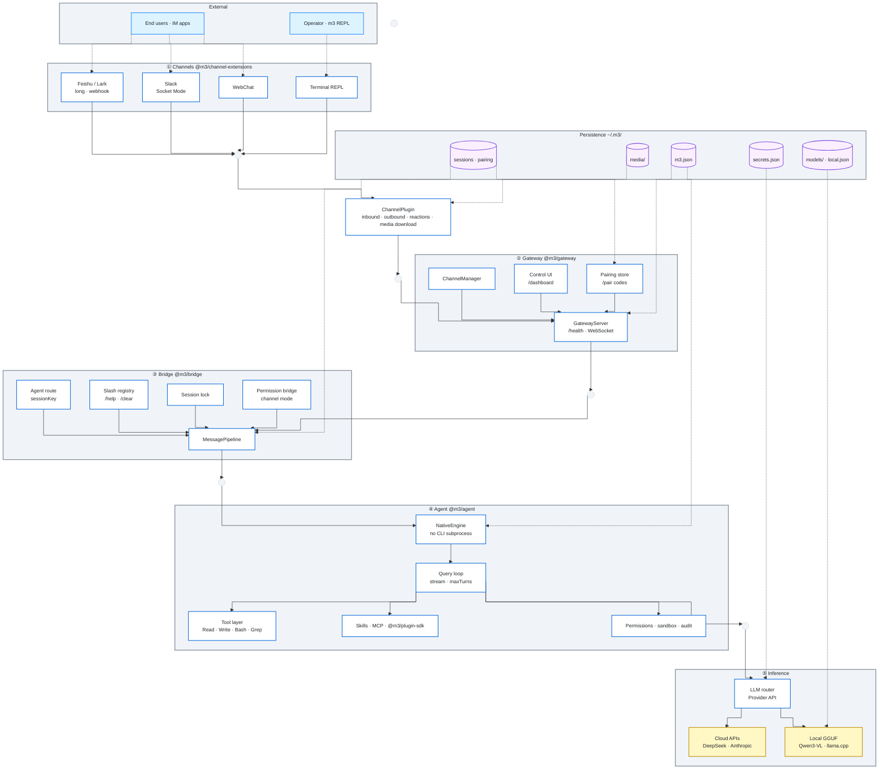
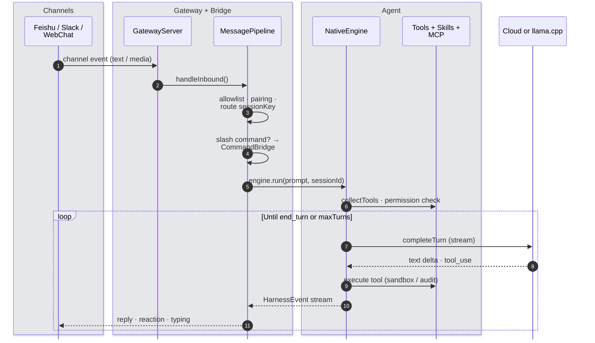

# m3

**Multi-modality · Multi-task · Multi-agent Framework**

An agent framework with OpenClaw-style channels, an in-process harness, tools, MCP, skills, and plugins — one Node runtime from inbound message to reply.

[](https://github.com/zhipengge/m3)
[](https://nodejs.org)
[](#)

[Install](#install) · [Usage](#usage) · [Local model](#local-offline-model) · [Features](#features) · [Architecture](#architecture) · [Channels](docs/CHANNELS.md)

> Channel event → bridge → native agent loop → LLM + tools → reply on the same channel. No external CLI subprocess. Config in `~/.m3/`.

## Install

```bash
git clone git@github.com:zhipengge/m3.git && cd m3
./install.sh && export PATH="$HOME/.local/bin:$PATH"

mkdir -p ~/.m3
cp examples/secrets.json.example ~/.m3/secrets.json   # API keys
chmod 600 ~/.m3/secrets.json
cp examples/m3.json ~/.m3/m3.json                     # optional

m3 doctor
```

| Optional | Command |
|----------|---------|
| Tab completion | `m3 completion install && exec zsh` (global `m3` only) |
| Feishu QR setup | `m3 channels scan` |
| Offline LLM | `m3 local` (GGUF presets or custom repo + llama.cpp; default Qwen3-VL-4B) |

Node **≥ 22.19** · macOS / Linux · `tar` / `unzip` for local setup

## Usage

```bash
m3                    # gateway + terminal REPL (default)
m3 channels scan      # bind Feishu, then run m3
m3 status             # dashboard → http://127.0.0.1:18790/dashboard
m3 agent -p "…"       # one-shot, no REPL
m3 gateway stop       # stop daemon
```

In the REPL (`you>`): natural language or slash commands — **Ctrl+C** exits.

**Tab completion:** type `/` then **Tab** to complete slash commands (menu lists on bare `/` + Tab). **`?`** opens `/help`. Shell-level: `m3 completion install`.

### Slash commands (Claude Code–style)

| Command | Action |
|---------|--------|
| `/help` | List commands |
| `/status` · `/context` | Session + model + context window usage (~%, auto-compress at 90%) |
| `/clear` | Clear session (`/reset`, `/new` aliases) |
| `/compact [focus]` | Compress transcript history (same algorithm as 90% auto-compress) |
| `/goal <condition>` | Set a session goal; `/goal` shows it; `/goal clear` clears |
| `/plan` | Plan-mode prompt |
| `/model <ref>` | Show model ref |
| `/mcp` · `/skills` · `/doctor` · … | See `/help` |

**Contributors:** `pnpm install && pnpm build && pnpm test`

**Verify local stack:** `pnpm build && node scripts/verify-local.mjs` (needs `m3 local` + running llama-server)

## Local offline model

Run **local GGUF** models on-device via **llama.cpp** (no cloud API key). Default: **Qwen3-VL-4B-Instruct**; use `--model` for other presets or any Hugging Face / ModelScope repo:

```bash
m3 local                              # default qwen3-vl-4b-instruct
m3 local --model qwen3-vl-8b-instruct
m3 local list
m3 chat
```

| Command | |
|---------|--|
| `m3 local` | Full setup |
| `m3 local list` | Built-in model presets |
| `m3 local download` | GGUF weights only |
| `m3 local start` / `stop` / `status` | Manage llama-server |

Details: [**docs/LOCAL.md**](docs/LOCAL.md). Install `aria2` for resume + concurrent GGUF downloads.

```bash
m3 agent -p "hello"     # one-shot against local model (auto-starts llama-server)
node scripts/verify-local.mjs   # doctor + slash cmds + local agent smoke test
```

## Features

| | |
|:--|:--|
| **Multi-modality** | Images, files, and structured media on `InboundMessage.media` → `~/.m3/media/` paths in the agent prompt |
| **Multi-task** | Feishu + Slack + WebChat in parallel; multi-account; session locks; live dashboard |
| **Multi-agent** | Per-conversation `sessionKey`, sub-agents, pairing & allowlists, channel permission modes |
| **Channels** | Feishu long connection or webhook · Slack Socket Mode · WebChat |
| **Harness** | In-process loop · DeepSeek · Anthropic · **local llama.cpp** · mock engine |
| **Security** | Workspace sandbox · Bash allowlist · audit log |
| **Ecosystem** | `SKILL.md` · MCP · `@m3/plugin-sdk` plugins |
| **DX** | Claude Code–style terminal · zsh completion · `/dashboard` console |

## Architecture

m3 runs as **one Node process**. Solid lines are the runtime request path (orthogonal routing); dashed lines are configuration and persistence under `~/.m3/`.

### System overview



| Symbol | Meaning |
|:--|:--|
| Solid arrows | Inbound dispatch → agent turn → inference |
| Dashed arrows | Config, secrets, sessions, downloaded media |
| `stepBefore` routing | Horizontal / vertical connectors only (no arcs) |

### Message lifecycle



### Layer reference

| Layer | Package | Key modules |
|:--|:--|:--|
| **Channels** | `channel-extensions` | Feishu (long / webhook), Slack Socket Mode, WebChat, `ChannelPlugin` contract |
| **Gateway** | `gateway` | `GatewayServer`, `ChannelManager`, control UI, pairing API, `EventLog` |
| **Bridge** | `bridge` | `MessagePipeline`, `resolveAgentRoute`, slash commands, `SessionLock`, `PermissionBridge` |
| **Agent** | `agent` | `NativeEngine`, `runQueryLoop`, built-in tools, Skills, MCP pool, plugins, sandbox |
| **Inference** | `agent` + `@m3/local` | `LLM router` → DeepSeek / Anthropic, or `m3 local` → OpenAI-compatible server |

Full design notes → [docs/ARCHITECTURE.md](docs/ARCHITECTURE.md)

## Configuration

| Path | Contents |
|------|----------|
| `~/.m3/m3.json` | Models, gateway, agent, channels |
| `~/.m3/secrets.json` | API keys — never commit |

Templates: [`examples/m3.json`](examples/m3.json) · [`examples/secrets.json.example`](examples/secrets.json.example)

<details>
<summary>Example <code>agent</code> block</summary>

```json
{
  "agent": {
    "engine": "native",
    "model": "deepseek/deepseek-chat",
    "channelPermissionMode": "bypassPermissions",
    "sandbox": { "enabled": true }
  }
}
```

</details>

Channel setup: [**docs/CHANNELS.md**](docs/CHANNELS.md)

## CLI

| Command | |
|---------|--|
| `m3` / `m3 chat` | Interactive gateway + REPL |
| `m3 gateway` | Start gateway |
| `m3 gateway stop` | Stop gateway |
| `m3 channels scan` | Feishu QR onboarding |
| `m3 channels configure` | Channel wizard |
| `m3 channels list` / `remove` | Manage accounts |
| `m3 doctor` / `m3 status` | Health · port · PID · dashboard URL |
| `m3 agent -p "…"` | Headless prompt |
| `m3 completion install` | zsh completions |
| `m3 local` | Offline GGUF models (default Qwen3-VL-4B; `--model` for others) |

## Develop

```bash
pnpm test && m3 doctor && pnpm verify:mcp:connect
```

[docs/DEVELOPMENT.md](docs/DEVELOPMENT.md) · [docs/IMPROVEMENTS.md](docs/IMPROVEMENTS.md)

---

MIT
