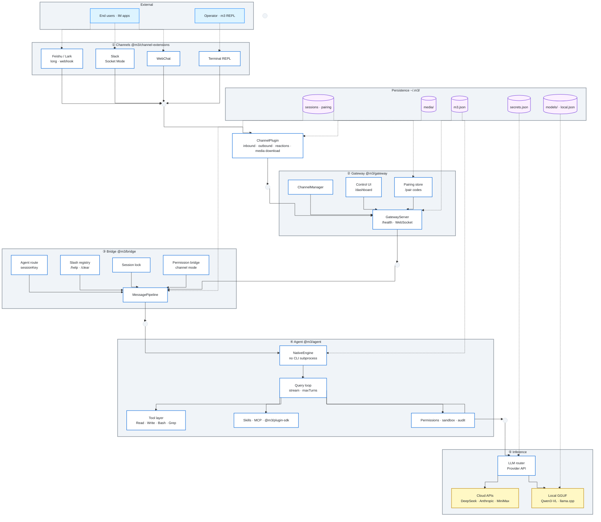
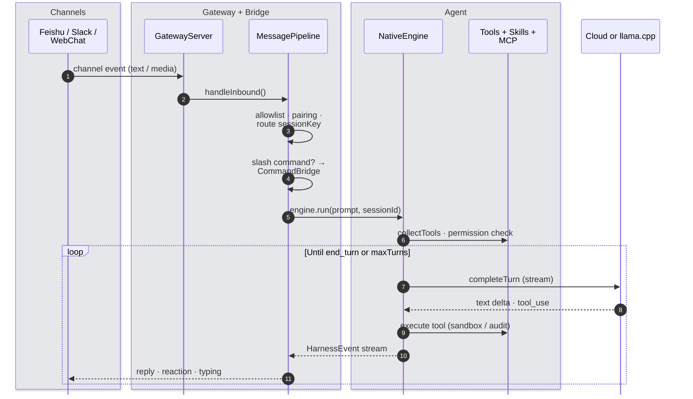

# m3

**Multi-modality · Multi-task · Multi-agent Framework**

An agent framework with OpenClaw-style channels, an in-process harness, tools, MCP, skills, and plugins — one Node runtime from inbound message to reply.

[](https://github.com/zhipengge/m3)
[](https://nodejs.org)
[](#)

[Install](#install) · [Usage](#usage) · [Local model](#local-offline-model) · [MiniMax](docs/MINIMAX.md) · [Features](#features) · [Architecture](#architecture) · [Channels](docs/CHANNELS.md)

> Channel event → bridge → native agent loop → LLM + tools → reply on the same channel. No external CLI subprocess. Config in `~/.m3/`.

## Install

```bash
git clone git@github.com:zhipengge/m3.git && cd m3
./install.sh
```

脚本会完成：依赖安装与构建、把 `m3` 装到 `~/.local/bin`、初始化 `~/.m3/`（`m3.json` + `secrets.json`）、必要时写入 shell 的 PATH。

然后填入 API Key 并启动。**安装刚结束时当前终端还没有 `m3` 命令**（PATH 要 `source` 或新开终端才生效），可任选其一：

```bash
$EDITOR ~/.m3/secrets.json
~/.local/bin/m3              # 当前终端立刻可用
# 或
source ~/.zshrc && m3        # 之后可直接打 m3（bash 用 ~/.bashrc）
```

可选步骤：

```bash
# Tab 补全
./install.sh --with-completion
# 或：m3 completion install

# 飞书扫码绑定
m3 channels scan

# 离线 GGUF（默认 Qwen3-VL-4B，见 docs/LOCAL.md）
m3 local

# 开发者：跳过 build
./install.sh --skip-build
```

Node **≥ 22.19** · macOS / Linux · `tar` / `unzip` for local setup

## Usage

In the REPL (`›` prompt): natural language or slash commands. **Ctrl+C** exits and shuts down the gateway (press again to force quit if shutdown stalls).

### Core

```bash
# Gateway + terminal REPL (default)
m3
m3 chat

# Health, port, PID, dashboard URL
m3 doctor
m3 status

# Start or stop gateway only
m3 gateway
m3 gateway stop

# One-shot prompt (no REPL)
m3 agent -p "…"
```

### Channels

```bash
# Feishu QR onboarding (recommended)
m3 channels scan

# Wizard · list · remove accounts
m3 channels configure
m3 channels list
m3 channels remove
```

### Models

```bash
# List cloud + local models (API key status)
m3 models

# Show or switch active model (writes ~/.m3/m3.json)
m3 model
m3 model deepseek-chat
m3 model MiniMax-M3
```

Dashboard: `m3 status` → http://127.0.0.1:18790/dashboard

### Workspace & permissions

On **`m3` / `m3 chat` startup**, m3 asks once whether it may read/write the **current working directory**:

```text
Choice [Y/n]:   Y / 是 — allow (default, Enter)
                n / 否 — deny and exit
```

After you allow, **Write / Edit** and built-in file tools run under that folder for the session (`agent.cwd` is pinned to your launch directory). In `~/.m3/mcp.json`, point the filesystem MCP server at `{{WORKSPACE}}` — **not** `/tmp` (on macOS that appears as `/private/tmp`).

| `agent.permissionMode` | Behavior |
|------------------------|----------|
| `default` | Workspace grant at startup; **Bash** may prompt separately in the REPL |
| `acceptEdits` | Auto-approve file edits; Bash still restricted |
| `bypassPermissions` | No prompts. **Not** the channel default — set `agent.channelPermissionMode: "bypassPermissions"` only after auditing risk. |

### Terminal UI (Ink)

Claude Code–style UI: streaming replies, breathing spinner, slash **command palette** (`/` + ↑↓ + Tab). Input uses **`ink-text-input`** (arrow keys, paste, CJK/IME-friendly).

**Reasoning models** (e.g. `MiniMax-M3`, `deepseek-reasoner`) stream a **∴ Thinking…** block before the reply. **Ctrl+O** or `/thinking` toggles expand/collapse; default is expanded (`agent.thinkingDisplay` in `~/.m3/m3.json`).

```bash
# Plain readline REPL (no Ink)
m3 chat --plain
# or: M3_PLAIN_REPL=1 m3 chat

# Skip workspace grant prompt (CI)
M3_SKIP_WORKSPACE_GRANT=1 m3 chat

# Shell tab completion
m3 completion install
```

Default reasoning UI is expanded; set `"thinkingDisplay": "collapsed"` under `agent` in `~/.m3/m3.json` to start collapsed.

Built-in cloud providers: **DeepSeek**, **Anthropic**, **MiniMax** (OpenAI-compatible). See [docs/MINIMAX.md](docs/MINIMAX.md).

### Slash commands (REPL)

```bash
/help                    # list commands
/status                  # session + model + context usage (~%, auto-compress at 90%)
/context
/clear                   # clear session (/reset, /new)
/compact [focus]         # compress transcript history
/goal <condition>        # set goal; /goal shows; /goal clear clears
/plan                    # plan-mode prompt
/model [ref]             # show model; switch via m3 model <ref>
/thinking                # toggle reasoning display (Ctrl+O in Ink REPL)
/mcp · /skills · /doctor # see /help
```

**Contributors:** `pnpm install && pnpm build && pnpm test`

**Verify local stack:** `pnpm build && node scripts/verify-local.mjs` (needs `m3 local` + running llama-server)

## Local offline model

Run **local GGUF** models on-device via **llama.cpp** (no cloud API key). Default: **Qwen3-VL-4B-Instruct**; use `--model` for other presets or any Hugging Face / ModelScope repo:

```bash
# Full setup (default: qwen3-vl-4b-instruct)
m3 local
m3 local --model qwen3-vl-8b-instruct

# Presets · download GGUF · manage llama-server
m3 local list
m3 local download
m3 local start
m3 local stop
m3 local status

# Chat with local model (auto-starts llama-server)
m3 chat
m3 agent -p "hello"

# Smoke test
node scripts/verify-local.mjs
```

Details: [**docs/LOCAL.md**](docs/LOCAL.md). Install `aria2` for resume + concurrent GGUF downloads.

## Features

| | |
|:--|:--|
| **Multi-modality** | Images, files, and structured media on `InboundMessage.media` → `~/.m3/media/` paths in the agent prompt |
| **Multi-task** | Feishu + Slack + WebChat in parallel; multi-account; session locks; live dashboard |
| **Multi-agent** | Per-conversation `sessionKey`, sub-agents, pairing & allowlists, channel permission modes |
| **Channels** | Feishu long connection or webhook · Slack Socket Mode · WebChat |
| **Harness** | In-process loop · DeepSeek · Anthropic · **MiniMax** · **local llama.cpp** · mock engine |
| **Security** | Workspace sandbox · Bash allowlist · audit log |
| **Ecosystem** | `SKILL.md` · MCP · `@m3/plugin-sdk` plugins |
| **DX** | `m3 models` / `m3 model` · workspace grant · Ink REPL · **∴ Thinking** (Ctrl+O) · zsh completion · `/dashboard` |

## Architecture

m3 runs as **one Node process**. Solid lines are the runtime request path (orthogonal routing); dashed lines are configuration and persistence under `~/.m3/`.

### System overview



| Symbol | Meaning |
|:--|:--|
| Solid arrows | Inbound dispatch → agent turn → inference |
| Dashed arrows | Config, secrets, sessions, downloaded media |
| `stepBefore` routing | Horizontal / vertical connectors only (no arcs) |

### Message lifecycle



### Layer reference

| Layer | Package | Key modules |
|:--|:--|:--|
| **Channels** | `channel-extensions` | Feishu (long / webhook), Slack Socket Mode, WebChat, `ChannelPlugin` contract |
| **Gateway** | `gateway` | `GatewayServer`, `ChannelManager`, control UI, pairing API, `EventLog` |
| **Bridge** | `bridge` | `MessagePipeline`, `resolveAgentRoute`, slash commands, `SessionLock`, `PermissionBridge` |
| **Agent** | `agent` | `NativeEngine`, `runQueryLoop`, built-in tools, Skills, MCP pool, plugins, sandbox |
| **Inference** | `agent` + `@m3/local` | `LLM router` → DeepSeek / Anthropic / MiniMax, or `m3 local` → OpenAI-compatible server |

Full design notes → [docs/ARCHITECTURE.md](docs/ARCHITECTURE.md)

## Configuration

| Path | Contents |
|------|----------|
| `~/.m3/m3.json` | Models, gateway, agent, channels |
| `~/.m3/secrets.json` | API keys — never commit |

Templates: [`examples/m3.json`](examples/m3.json) · [`examples/secrets.json.example`](examples/secrets.json.example) · [`examples/mcp.json`](examples/mcp.json) (`{{WORKSPACE}}` for filesystem MCP)

<details>
<summary>Example <code>agent</code> block</summary>

```json
{
  "agent": {
    "engine": "native",
    "model": "minimax/MiniMax-M3",
    "thinkingDisplay": "expanded",
    "channelPermissionMode": "default",
    "sandbox": { "enabled": true }
  }
}
```

</details>

Channel setup: [**docs/CHANNELS.md**](docs/CHANNELS.md)

## Develop

```bash
pnpm test && m3 doctor && pnpm verify:mcp:connect
```

[docs/DEVELOPMENT.md](docs/DEVELOPMENT.md) · [docs/IMPROVEMENTS.md](docs/IMPROVEMENTS.md)

---

MIT
