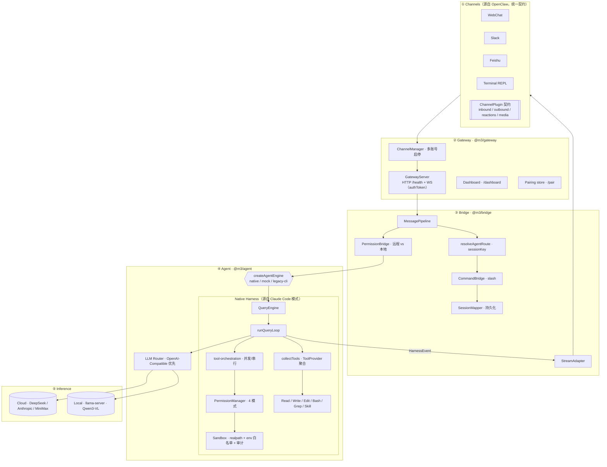
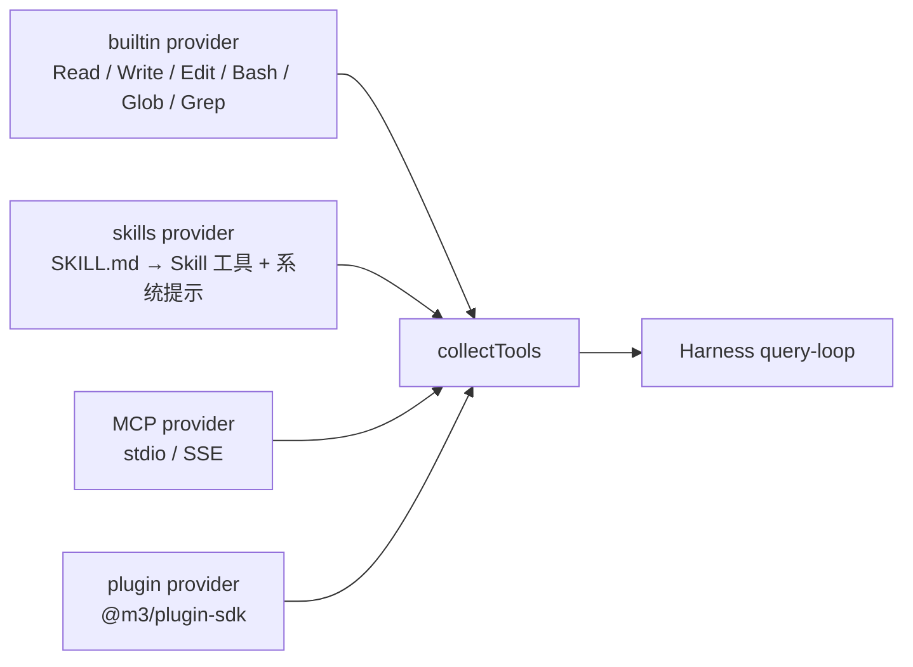

# Architecture

m3 = **Multi-modality · Multi-task · Multi-agent framework**。设计取舍只有一句话：

> 一份消息从任何通道进来 → 走同一条管道 → 同一个 in-process Agent Harness → 同一组工具/Skill/MCP/插件 → 回到原通道。

这意味着没有 Claude Code CLI 子进程、没有"为 Slack 写一遍工具栈"、没有"终端能干但飞书不行"。本文是这条管道的设计速查。

---

## 决定 m3 长这样的 4 个取舍

| 取舍 | 选择 | 为什么 | 代价 |
|------|------|--------|------|
| **进程模型** | 单 Node 进程、内嵌 Harness | 低延迟、统一审计、可跨通道共享会话/缓存 | 单点崩溃域（用 `m3 status`/`gateway.pid` 弥补） |
| **工具契约** | 统一 `ToolDefinition`；MCP/Skill/Plugin 都收敛到这一层 | 一份权限/沙箱/审计代码就能覆盖所有扩展面 | 新生态先要做 adapter |
| **权限分层** | `permissionMode`（本地终端） vs `channelPermissionMode`（远程入口）双轨 | 本地 OP 可以全放行，远程 IM 用户必须受限 | 用户多一个概念 |
| **模型抽象** | OpenAI-Compatible 优先；新 provider 30 行 JSON | 不为每家 SDK 写胶水；本地 `llama-server` 直接复用 | 厂商私有特性需要 adapter |

---

## 分层架构



---

## 一条消息的生命周期

```mermaid
sequenceDiagram
    autonumber
    participant U as 用户（任意通道）
    participant P as MessagePipeline
    participant Eng as NativeEngine
    participant CT as collectTools
    participant Loop as runQueryLoop
    participant Perm as PermissionManager
    participant Sec as Sandbox / Audit
    participant LLM as LLM Router

    U->>P: handleInbound(msg)
    P->>P: dmPolicy / allowFrom / pairing
    P->>P: route → sessionKey → slash 命令
    P->>Eng: engine.run(prompt, sessionId, cwd)
    Eng->>CT: builtin + Skill + MCP + Plugin 聚合
    loop until end_turn / maxTurns
        Eng->>Loop: completeTurn
        Loop->>LLM: messages + tools (+ skill catalog)
        LLM-->>Loop: 文本增量 + tool_use
        Loop->>Perm: canUseTool(meta)
        Loop->>Sec: realpath 沙箱 + env 白名单 + JSON 审计
        Loop-->>P: HarnessEvent 流
        P->>U: 流式回包 + 反应表情
    end
```

---

## 安全决策矩阵

工具能不能跑，由 `permissionMode` 决定；远程通道用 `channelPermissionMode`，两条线**互不影响**。

| permissionMode | 只读工具 | 写工具（Write / Edit） | Bash |
|----------------|---------|----------------------|------|
| `plan` | 允许 | **过滤掉**，不出现在工具集 | 过滤掉 |
| `default` | 允许 | 询问 / 默认拒绝 | 询问 / 默认拒绝 |
| `acceptEdits` | 允许 | 自动允许 | 询问 / 默认拒绝 |
| `bypassPermissions` | 允许 | 允许 | 允许 |

工具层在权限之上再加三道关：

1. **工作区沙箱**：`resolveWithinWorkspace` 用 `fs.realpathSync` 反查实际路径，**符号链接逃逸**会被拒绝。
2. **Bash env 白名单**：`buildSandboxedEnv` 只放行白名单变量；即使 operator 显式 allowlist 了 `MY_SECRET_KEY`，名字命中 `KEY|SECRET|TOKEN|PASSWORD|CREDENTIAL` 也会被剥离。
3. **审计日志**：每次工具执行 / 权限决策都打一行 `[m3:audit]` JSON（带敏感字段脱敏），可送 Datadog / Loki。

Bash 静态规则覆盖 17 类：`rm -rf /`、`curl | sh`、`sudo`、`ssh user@host`、`nc -l`、`python/node -e`、`git push --force`、fork bomb 等，单测 `bash-safety.test.ts` 覆盖。

---

## 从 Claude Code 借鉴的模式

m3 不是 Claude Code 的衍生发行版，但 query loop / Tool / 并发编排 / Skill 这套抽象很合理，所以照搬了思想：

| CC 模块 | m3 模块 | 说明 |
|---------|---------|------|
| `query.ts` queryLoop | `harness/query-loop.ts` | LLM ↔ 工具循环 |
| `QueryEngine.ts` | `harness/query-engine.ts` | 会话级封装 + transcript |
| `Tool.ts` | `harness/types.ts → ToolDefinition` | 工具契约 |
| `toolOrchestration.ts` | `harness/tool-orchestration.ts` | 并发 / 串行分区 + 审计 |
| `permissions/` | `permissions/manager.ts` | 4 个 permissionMode 策略 |
| Skill（progressive disclosure） | `skills/` + `tools/tool-source.ts` | `SKILL.md` 加载 + Skill 工具 |

不同点：
- m3 是 **库 + Gateway**，不是单进程 TUI；harness 直接调 `@anthropic-ai/sdk` / OpenAI 兼容端点，不 spawn 子进程。
- 多了 `PermissionBridge`（区分远程 vs 本地）、`ChannelManager`、`StreamAdapter`，因为通道是 first-class。
- 沙箱多了 realpath 校验和 env 二级黑名单，针对 IM 通道的攻击面。

---

## ToolProvider 聚合层

所有工具来源实现同一个 `ToolDefinition`，由 `collectTools(config)` 聚合成最终工具集：



- **去重**：先到者胜，内置核心工具不会被外部 provider 覆盖（防止恶意插件劫持 `Bash`）。
- **plan 模式**：聚合后再过滤为只读工具。
- **扩展点**：`registerToolProvider(provider)` 注入新来源；CLI 启动时按 `plugins.entries` / `plugins.paths` / `agent.skills.dirs` / `agent.mcp.config` 顺序加载。

### Skill 格式（与 Claude Code 兼容）

```
---
name: my-skill
description: 何时使用本 skill（用于 progressive disclosure）
---
<markdown 正文：被加载后的完整指令>
```

加载流程：`agent.skills.dirs` → 扫描 `SKILL.md` / `*/SKILL.md` → 解析 frontmatter → 系统提示里只列 `name: description`（**不灌正文**，节省 context）→ 模型按需调用 `Skill` 工具取正文。

---

## LLM Router 与本地优先

`agent.model` 是一个 `provider/model` 字符串。Router 把它解析成：

- **OpenAI-Compatible**：`api: "openai-chat"`，DeepSeek / MiniMax / `llama-server` 全部走这条路，差异只在 `baseUrl` 与 `apiKeyEnv`。
- **Anthropic Messages**：`api: "anthropic-messages"`，原生支持 thinking / tool_use。
- **Cascade**：`api: "cascade"`，按 `tiers` 顺序尝试（本地失败 → 升级到云）。

`localOnly: true` 是 provider 级别的硬开关：开启后，**router 拒绝**为该 provider 实例化任何非本地 baseUrl 的客户端。这是给"我有客户数据，绝不能跑到外网"场景的兜底，比代码评审更可靠。

---

## 引擎选择

`~/.m3/m3.json → agent.engine`：

| 值 | 用途 |
|----|------|
| `native`（默认） | in-process harness + LLM Router |
| `mock` | 离线测试（`M3_MOCK_AGENT=1`） |
| `legacy-cli` | 旧 CC 子进程模式，不推荐，仅留作回归 |

---

## 扩展工具的两种姿势

**A. 写一个内置工具**（适合核心能力）：

```typescript
// packages/agent/src/tools/my-tool.ts
export const myTool: ToolDefinition = {
  name: "MyTool",
  description: "...",
  inputSchema: { type: "object", properties: {...}, required: [...] },
  isReadOnly: true,
  isConcurrencySafe: true,
  execute: async (input, ctx) => ({ content: "..." }),
};
```

到 `tools/registry.ts` 注册即可。会自动参与去重 / 权限 / 沙箱 / 审计。

**B. 写一个外部插件**（适合生态，无需 fork 主仓）：

```typescript
import { definePlugin, registerM3Plugin } from "@m3/plugin-sdk";

registerM3Plugin(definePlugin({
  id: "my-plugin",
  register(api) {
    api.registerTool({ /* … */ });
    api.registerCommand("my-cmd", () => ({ action: "reply_only", text: "ok" }));
  },
}));
```

放到 `~/.m3/plugins/my-plugin.mjs`，在 `m3.json → plugins.paths` 加路径。首次加载会记录 SHA，文件变化会要求 `m3 plugins approve`。

---

## 文件落点速查

| 路径 | 用途 |
|------|------|
| `~/.m3/m3.json` | 主配置（models / gateway / agent / channels / plugins） |
| `~/.m3/secrets.json` | API Keys（`0o600`，doctor 会告警权限） |
| `~/.m3/mcp.json` | MCP servers（`{{WORKSPACE}}` 占位） |
| `~/.m3/sessions.json` | sessionKey ↔ session id 映射 |
| `~/.m3/pairing.json` | `/pair` 通过的 peer 白名单 |
| `~/.m3/transcripts/<id>.jsonl` | 单会话流水（`/clear` 走 `_archive/`） |
| `~/.m3/media/<channel>/<account>/` | 入站附件 |
| `~/.m3/memory/<project>.md` | 跨会话记忆 |
| `~/.m3/event-log.jsonl` | Gateway 事件流（dashboard 也在读它） |
| `~/.m3/gateway.pid` | `m3 status` / `m3 gateway stop` 用 |
| `~/.m3/models/<id>/` | 本地 GGUF 权重 |
| `~/.m3/runtime/llama.cpp/` | 本地 llama-server 二进制 |

---

## 相关文档

- [`README.md`](../README.md) —— 入口、安装、Why m3
- [`docs/CHANNELS.md`](CHANNELS.md) —— 通道接入与权限调优
- [`docs/LOCAL.md`](LOCAL.md) —— 离线 GGUF 模型
- [`docs/MINIMAX.md`](MINIMAX.md) —— MiniMax 接入与 thinking
- [`docs/IMPROVEMENTS.md`](IMPROVEMENTS.md) —— 已落地优化清单
- [`docs/ROADMAP-2026.md`](ROADMAP-2026.md) —— 已延后的 Tier C 想法
