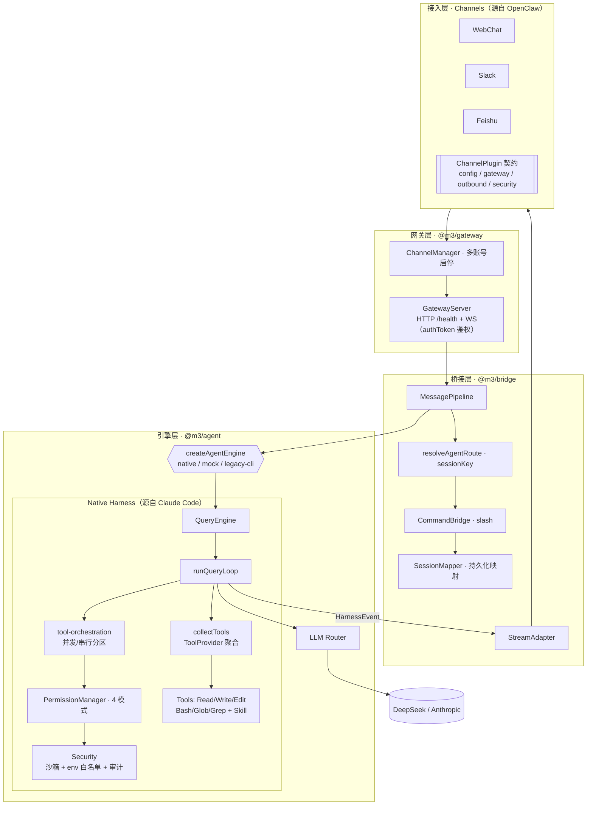
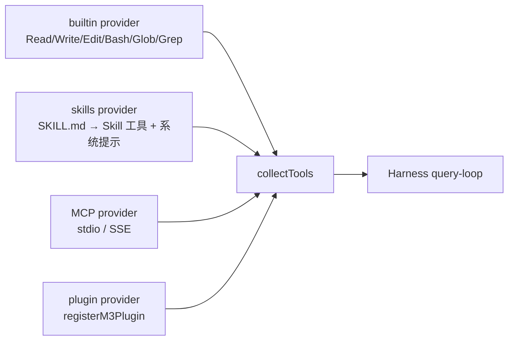

# m3 Architecture

m3 = **多模态 · 多任务 · 多智能体框架**（Multi-modality · Multi-task · Multi-agent）。使用 **自研 in-process Agent Harness**，不依赖 Claude Code CLI 子进程，并通过统一的 `ToolProvider` 聚合层兼容 Claude Code / OpenClaw 生态（工具、Skill、MCP、插件）。

## 分层架构



## 一条消息的生命周期

```mermaid
sequenceDiagram
    participant U as 用户(通道)
    participant P as MessagePipeline
    participant Eng as NativeEngine
    participant CT as collectTools
    participant Loop as runQueryLoop
    participant Perm as PermissionManager
    participant Sec as Sandbox/Audit
    participant LLM as LLM Provider

    U->>P: handleInbound(msg)
    P->>P: isAllowedSender → route → slash 命令
    P->>Eng: engine.run(prompt, sessionId, cwd)
    Eng->>CT: 聚合内置 + Skill 工具 + 系统提示
    loop 直到 end_turn / maxTurns
        Eng->>Loop: completeTurn
        Loop->>LLM: messages + tools (+ skill catalog)
        LLM-->>Loop: 文本增量 + tool_use
        Loop->>Perm: canUseTool(元数据)
        Loop->>Sec: 沙箱校验路径 / env 白名单 / 审计记录
        Loop-->>P: HarnessEvent 流
        P->>U: 增量回复
    end
```

## 安全决策矩阵

| permissionMode | 只读工具 | 写工具(Write/Edit) | Bash |
|----------------|---------|-------------------|------|
| `plan` | 允许 | 拒绝（工具被过滤） | 拒绝 |
| `default` | 允许 | 询问 / 默认拒绝 | 询问 / 默认拒绝 |
| `acceptEdits` | 允许 | 允许 | 询问 / 默认拒绝 |
| `bypassPermissions` | 允许 | 允许 | 允许 |

工具层在权限之上再加：**工作区沙箱**（`resolveWithinWorkspace` 拒绝路径穿越）、**Bash env 白名单**（`buildSandboxedEnv` 仅透传安全变量）、**审计日志**（`[m3:audit]` 结构化 JSON）。

## 从 Claude Code 迁移的核心模式

| CC 模块 | m3 模块 | 说明 |
|---------|---------|------|
| `query.ts` queryLoop | `harness/query-loop.ts` | API ↔ 工具循环 |
| `QueryEngine.ts` | `harness/query-engine.ts` | 会话级封装 + transcript |
| `Tool.ts` | `harness/types.ts` ToolDefinition | 工具契约 |
| `toolOrchestration.ts` | `harness/tool-orchestration.ts` | 并发/串行分区 + 审计 |
| `permissions/` | `permissions/manager.ts` | permissionMode 策略 |
| Skill (progressive disclosure) | `skills/` + `tools/tool-source.ts` | SKILL.md 加载 + Skill 工具 |

## 生态兼容：ToolProvider 聚合层

所有工具来源都实现同一 `ToolDefinition` 契约，由 `collectTools(config)` 聚合：



- **去重**：先到者胜，核心工具不会被外部 provider 覆盖。
- **plan 模式**：聚合后过滤为只读工具。
- **扩展**：`registerToolProvider(provider)` 注入新来源（MCP / 插件）。

### Skill 格式（Claude Code 兼容）

```
---
name: my-skill
description: 何时使用本 skill（用于 progressive disclosure）
---
<markdown 正文：被加载后的完整指令>
```

加载流程：`agent.skills.dirs` → 扫描 `SKILL.md` / `*/SKILL.md` → 解析 frontmatter → 系统提示列出 `name: description` → 模型调用 `Skill` 工具按需取正文。

## 引擎选择

`~/.m3/m3.json` → `agent.engine`：

- **`native`**（默认）：in-process harness + LLM Router（DeepSeek/Anthropic）
- **`mock`**：离线测试（`M3_MOCK_AGENT=1`）
- **`legacy-cli`**：旧版 CLI 子进程（不推荐）

## 扩展工具

在 `packages/agent/src/tools/` 新增 `ToolDefinition` 并注册到 `registry.ts`；或实现一个 `ToolProvider` 并 `registerToolProvider` 注入（推荐用于外部生态）。

```typescript
export const myTool: ToolDefinition = {
  name: "MyTool",
  description: "...",
  inputSchema: { type: "object", properties: {...}, required: [...] },
  isReadOnly: true,
  isConcurrencySafe: true,
  execute: async (input, ctx) => ({ content: "..." }),
};
```
